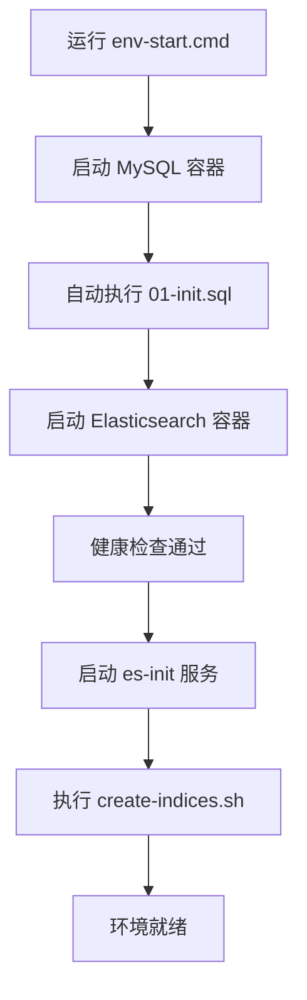

# 开发环境配置指南

## 必需环境
- JDK 17+
- Git
- Docker & Docker Compose

## 🐳 快速启动开发环境

**一键启动完整开发环境：**

### Windows 开发者
```cmd
# 启动 Docker 环境（ES + MySQL）
scripts\env-start.cmd

# 停止环境
scripts\env-stop.cmd
```

### Linux/Mac 开发者
```bash
# 启动 Docker 环境（ES + MySQL）
chmod +x scripts/*.sh
scripts/env-start.sh

# 停止环境
scripts/env-stop.sh
```

## 🔗 服务访问信息

启动后可访问：
- **Elasticsearch**: http://localhost:9200
- **MySQL**: localhost:3306
  - 数据库: `archimedes_db`
  - 用户: `archimedes` / `archimedes123`

## 重要：使用项目自带的 Maven Wrapper

**⚠️ 请勿使用系统全局安装的 Maven！**

本项目使用 Maven Wrapper 来确保所有开发者使用相同的 Maven 版本。

### Windows 开发者
```cmd
# 构建项目
.\mvnw.cmd clean compile

# 运行测试
.\mvnw.cmd test
# 运行测试类
.\mvnw.cmd test -Dtest=ElasticsearchIndexTest
# 运行测试类指定方法
.\mvnw.cmd test -Dtest=ElasticsearchIndexTest#testConnection

# 启动应用
.\mvnw.cmd spring-boot:run

# 或者使用项目脚本
scripts\build.cmd
scripts\test.cmd
scripts\run.cmd
```

### Linux/Mac 开发者
```bash
# 构建项目
./mvnw clean compile

# 运行测试
./mvnw test

# 启动应用
./mvnw spring-boot:run

# 或者使用项目脚本
chmod +x scripts/*.sh
scripts/build.sh
scripts/test.sh
scripts/run.sh
```

## 📁 项目结构

```
archimedes/
├── docker/                    # Docker 相关配置
│   └── db/                   # 数据库初始化脚本
│       ├── mysql/            # MySQL DDL 脚本
│       └── elasticsearch/    # ES 索引创建脚本
├── scripts/                  # 便捷脚本
│   ├── env-start.cmd/.sh    # 启动环境
│   ├── env-stop.cmd/.sh     # 停止环境
│   ├── build.cmd/.sh        # 构建项目
│   ├── test.cmd/.sh         # 运行测试
│   └── run.cmd/.sh          # 启动应用
├── src/                      # 源代码
├── docker-compose.yml        # Docker 服务定义
└── README.md                # 项目说明
```

## IDE 配置

### IntelliJ IDEA
1. 打开 File → Settings → Build, Execution, Deployment → Build Tools → Maven
2. 设置 Maven home path 为项目根目录下的 `.mvn/wrapper`
3. 或者在 Maven 设置中选择 "Use Maven wrapper"

### VS Code
确保安装了 Java Extension Pack，它会自动检测并使用 Maven Wrapper。

## 🗄️ 自动化数据库和索引初始化

### MySQL 表自动创建
**首次启动时，MySQL 会自动执行以下初始化：**
- 📄 **DDL脚本位置**: `docker/db/mysql/01-init.sql`
- 🔧 **创建内容**: 
  - `papers` - 论文元数据主表
  - `authors` - 作者信息表  
  - `paper_authors` - 论文-作者关联表
  - `citations` - 引用关系表

### Elasticsearch 索引自动创建
**首次启动时，ES 会自动执行以下初始化：**
- 📄 **索引脚本位置**: `docker/db/elasticsearch/create-indices.sh`
- 🔧 **创建内容**:
  - `paper_v1` 索引 - 支持全文检索和向量搜索
  - 768维 embedding 字段配置
  - 标题、摘要的全文检索配置

### 🚀 初始化流程说明


**⚠️ 重要提示**:
- 首次启动需要等待约1-2分钟完成所有初始化
- 如需重新初始化，删除 Docker 卷后重启：
  ```cmd
  docker-compose down -v
  scripts\env-start.cmd
  ```

## 🧪 环境验证

### 1. 验证 Docker 环境
```bash
# 检查服务状态
docker-compose ps

# 查看服务日志
docker-compose logs es-local
docker-compose logs mysql-local
docker-compose logs es-init
```

### 2. 验证数据库表创建
```bash
# 连接MySQL验证表结构
docker exec -it mysql-local mysql -u archimedes -parchimedes123 archimedes_db -e "SHOW TABLES;"
```

### 3. 验证 ES 索引创建
```bash
# 检查索引状态
curl http://localhost:9200/_cat/indices?v
curl http://localhost:9200/paper_v1/_mapping
```

### 4. 验证应用连接
```bash
# Windows
.\mvnw.cmd test -Dtest=ElasticsearchIndexTest

# Linux/Mac
./mvnw test -Dtest=ElasticsearchIndexTest
```

## 🤝 多人协作最佳实践

1. **环境一致性**: 所有开发者使用相同的 Docker 镜像版本
2. **数据库版本控制**: DDL 脚本统一管理在 `docker/db/` 目录
3. **Maven 版本控制**: 使用项目 Maven Wrapper
4. **一键环境**: 使用 `scripts/env-start` 命令快速搭建环境

## 🔧 简化 Git 工作流配置

### 快速设置
```cmd
# 1. 运行Git配置脚本
scripts\git-setup.cmd

# 2. 设置个人信息
git config --global user.name "你的姓名"
git config --global user.email "your.email@company.com"
```

### 两人协作模式
```cmd
# 日常开发（小改动）
git checkout develop && git pull origin develop
# 进行开发...
git add . && git commit -m "feat: 功能描述"
git push origin develop

# 大功能开发
scripts\git-branch.cmd new feature-name
# 开发完成后合并回develop
```

### 📋 简化提交规范
```bash
feat: 新功能
fix: 修复bug
docs: 文档更新
refactor: 代码重构
test: 测试相关
```

**📖 详细工作流**: 查看 [GIT_WORKFLOW.md](GIT_WORKFLOW.md) 了解完整的协作规范。

## 验证环境
运行以下命令验证环境配置正确：
```bash
# Windows
.\mvnw.cmd -version

# Linux/Mac
./mvnw -version
```

应该看到项目指定的 Maven 版本信息。